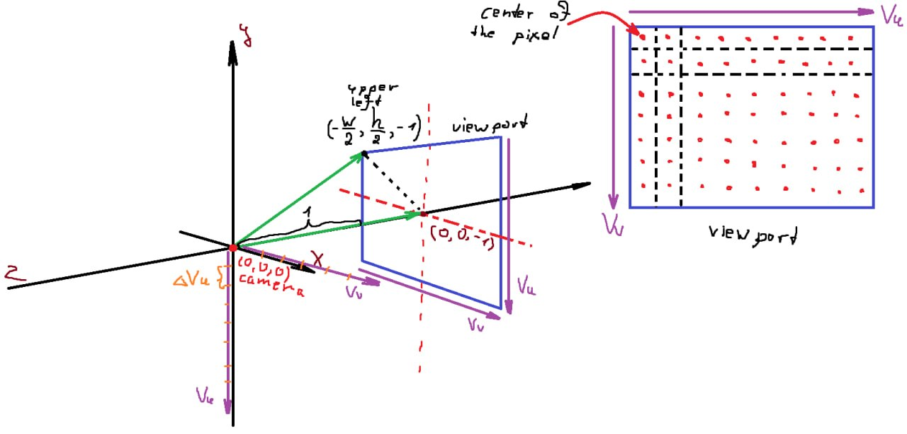
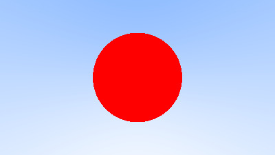
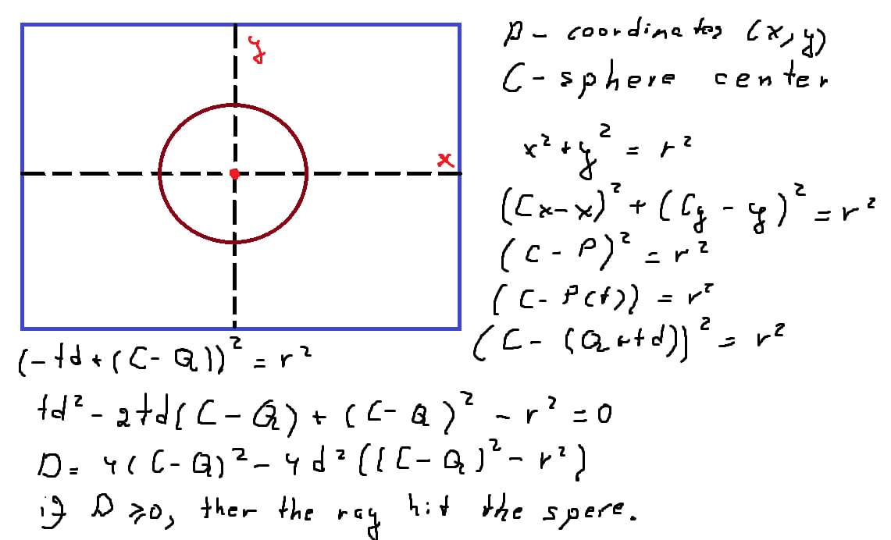
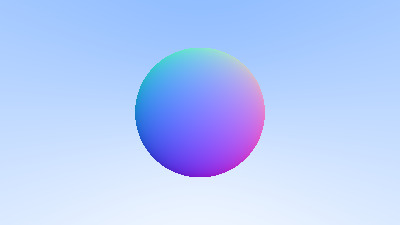

# Ray Tracer

A small ray tracer implemented in C++. I've used the following [article](https://raytracing.github.io/books/RayTracingInOneWeekend.html) as a reference.


## build & run

```sh
cmake -S . -B build
cmake --build build
./build/ray-tracer > output.ppm
```

```sh
rm -rf build/ # remove generated directory
```

## examples and explanation

### basic ppm gradient


### camera, background and viewport setup




Here is an overview of how our viewport (a virtual plane in 3D space) and camera are set up.

The camera is positioned at the default coordinates, the origin `(0, 0, 0)`. The viewport is placed at a distance of `1` unit in front of the camera along the negative z-axis. Therefore, the center of the viewport is located at `(0, 0, -1)`.

Since we want the viewport origin to correspond to the top-left corner of the image, we first determine the location of pixel `(0, 0)` and then define a way to iterate across the viewport.

To achieve this, we define two vectors:

- `Vu`, which spans the horizontal edge of the viewport
- `Vv`, which spans the vertical edge of the viewport

Using these vectors, we compute the per-pixel delta vectors along both axes. These delta vectors represent the step size between neighboring pixels and allow us to calculate the center position of each pixel on the viewport plane.

### sphere



using the sphere definition to define whether the ray intersects with the sphere or not.



### surface normals



I've calculated the normals(a direction pointing straight out of the surface at the hit point) of the sphere that goes from the center, outwards. Then I've ***colored*** the sphere with the corresponding to normals coordinates colors.

After setting up the normals, the following question occured ***Which side of the surface did we hit?***. Hence, we need to manage the case when the ray hits from the inside, thus inverting the normal. In consequence, I mananged to flip the normals to always face the ray.


The ground here is just a very large sphere with a center at ***(0, -100.5, -1)*** and with the radius of 100.

